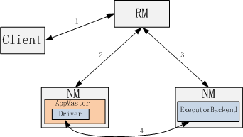
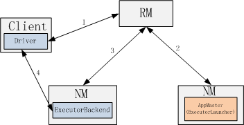
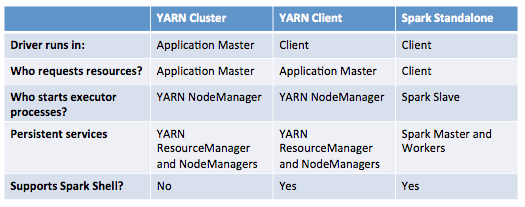

================
Spark Yarn Internal
================

基本概念
==========
* Application：包含一个或多个job；
* Spark Driver：负责job的初始化，将job转化成Task并提交执行；
* Spark Execuor: 一个jvm进程，可以并发执行Task；对于同一个app，每个节点上会有多个Executor进程？

任务提交
=========
提交命令
-----------------
* 具体提交的Yarn集群通过YARN_CONF_DIR中的配置文件获取；

::

    ./bin/spark-submit
        --class path.to.your.Class
        --master yarn-cluster | yarn -client
        [options]
        <app jar>
        [app options]

* 运行模式
    - yarn-cluster：driver被封装在AppMaster被yarn调度运行在yarn集群中；这个模式主要用于生产环境中；
    - yarn-client：driver运行在客户端，AppMaster只负责向yarn申请资源，driver拿到资源后负责任务的调度；这个模式主要用于交互模式或debug；

Yarn-Cluster
===========
* Yarn-Cluster部署模式主要包括三个核心组件：Client，AppMaster，AppSlave；Client负责提交作业(实际上请求执行的是AppMaster)，AppMaster负责为所有Task申请资源并调度Task执行，AppSlave负责Task的执行及状态汇报等；

    

Client
-----------
* SparkSubmit :: launch中通过org.apache.spark.deploy.yarn.Client提交yarn app；Client继承YarnClientImpl，主要用来提交Yarn作业，其中主要步骤包括，创建应用，设置应用的参数，提及应用；

* 创建应用
    - YarnClientImpl :: createApplication

* 设置应用参数
    - 主要是设置这个类ApplicationSubmissionContext
    - 包括App名称，队列，AppMaster占用资源（默认512M），另外一个重要参数是AppMaster的执行命令（类似java -xms -D class， yarn拿到后可以直接执行），其主要包括要执行的AppMaster类名，AppMaster需要的命令参数（用户driver class，每个executor需要的cpu，mem，java gc参数等）
    - 执行的AppMaster为org.apache.spark.deploy.yarn.ApplicationMaster
    - 参数num-executors： NUM Number of executors to start (Default: 2)   （TODO）

* 提交应用
    - YarnClientImpl :: submitApplication

* 监控作业执行进度
    - YarnClientImpl :: getApplicationReport，通过appId来监控，直到任务失败或成功

ApplicationMaster
-----------------------
* 应用提交到Yarn后，yarn会调度并执行ApplicationMaster(org.apache.spark.deploy.yarn.ApplicationMaster)，ApplicationMaster有两个职责：执行用户的Driver程序和请求ResourceManager申请资源；
主要流程
~~~~~~~~~
    * 创建到RM的client，AMRMClient :: createAMRMClient
    * 在一个线程中启动Driver
    * 向RM注册AppMaster，主要是告知RM该AppMaster的TrackingURL，方便在RM的UI中给AppMaster提供链接（TODO）
    * 创建资源分配器YarnAllocationHandler，它负责给Exeutor分配资源，通过YarnAllocationHandler为Executor分配资源
    * 等待Driver执行结束
    
    * AppMaster中如何拿到Driver中的SparkContext实例？（TODO）

资源申请
~~~~~~~~~~
* 资源申请
    - AMRMClient :: addContainerRequest(ContainerRequest)  发送申请
    - 资源申请分三个级别，HOST（要求在某个机器上启动contianer），RACK（要求在某个rack上启动），ANY（不做限制）；    资源请求通过ContainerRequest(resource, hosts, racks, prioritySetting)描述；   
    - 申请资源时可以指定启动多少个Executor，除了本地性的请求外，还会申请num_executor个ANY类型的资源请求（没有本地性需求的情况）
    - 对于有本地性要求的资源申请，除了在相应Host上申请外，还要在对应的Rack上申请相同的数量（host上不一定有充足的资源供使用）；
    - 数据本地性相关信息（host->set<Split>）从SparContext.preferredNodeLocationData获取，目前需要自己计算并传入SparkContxt，而不是从RDD中获取，很奇怪（TODO）
    ::
  
        val sc = new SparkContext(sparkConf,  InputFormatInfo.computePreferredLocations( Seq\(new InputFormatInfo(conf, classOf[org.apache.hadoop.mapred.TextInputFormat], inputPath)) ))

* 资源获取    
     - AMRMClient  :: allocate  获取分配得到的container 
     - 对Container进行选择，主要是将Container根据host，rack分别放到dataLocal，rackLocal，offRack三个集合中，依次启动；每个集合中按照host对Container排序（防止连续在某个host启动container，如先在host1启动若干个，再在host2上启动若干个等）

* 启动Contianer
    - 通过ExecutorRunnable :: run 启动得到的资源（Container）
    - 初始化ContainerLaunchContext, 主要构建Container执行命令：java  org.apache.spark.executor.CoarseGrainedExecutorBackend  +　参数, Container内存通过jvm Xms和Xmx限制
    - 启动Container，NMClient :: startContainer

运行Driver
~~~~~~~~~
* 这块主要是调用用户代码的main函数（初始化SparkContext，生成RDD和Stage，调度Task并监控Task执行过程）
* DAGScheduler
    - 负责生成RDD，Stage，Task，驱动整个流程（runJob）
* TaskScheduler
    - 负责作业的调度，在有限资源情况下，允许那些Task先执行
    - yarn-cluter：org.apache.spark.scheduler.cluster.YarnClusterScheduler
    - yarn-client：org.apache.spark.scheduler.cluster.YarnClientClusterScheduler
* SchedulerBackend
    - 负责管理该Job的执行资源，与ExecutorBackend交互(所有与Executor交互的接口都在SchedulerBackend中)，包括接收注册，接收executor状态更新，启动Task，杀死Task，停止Executor等
    - yarn-cluter：CoarseGrainedSchedulerBackend
    - yarn-client：org.apache.spark.scheduler.cluster.YarnClientSchedulerBackend
    - 其中通过freeCores保存每个Executor中可以使用的cores（注册时记录，执行Task时减掉，Task完成时再增加回来）

ApplicationSlave
------------------------
* ApplicationSlave实际上是CoarseGrainedExecutorBackend，如上所述，由AppMaster申请向RM资源并请求NM启动Container；
工作流程：
~~~~~~~~~
    * 创建连接Driver的actor
    * 发送RegisterExecutor消息（包括executorid，可以使用的cores，以及自己所监听的host：port，方便driver发送消息）给Driver，以便driver分配任务；
    * 循环监听driver发送的消息，并处理消息，消息包括RegisteredExecutor，RegisterExecutorFailed，LaunchTask，KillTask，StopExecutor等；Task通过Executor来执行；
 
执行任务：
~~~~~~~~~~
    Executor :: launchTask
            -> ThreadPool.execute(new TaskRunner)  //多线程模型
    一个Executor是否重复使用，怎么重复使用？（TODO）

Yarn-Client
===========
* 该模式下通过SparkSubmit直接在客户端执行用户程序（Driver），而需要的执行资源通过一个独立的yarn app来申请；
* YarnClientSchedulerBackend启动后会创建Yarn Application并提交给RM；这个Application主要是为job申请资源（AppMaster为ExecutorLauncher，ApplicationSlave为CoarseGrainedExecutorBackend），App也是通过org.apache.spark.deploy.yarn.Client来提交（参数不一样）

AppMaster
----------------
* Yarn-Client模式下AppMaster实际上是ExecutorLauncher，它不会执行Driver程序，只用来为Driver申请资源；
* ExecutorLauncher资源申请流程和Yarn-Cluster模式类似，也是包括资源申请，资源获取，启动资源三个主要步骤；由于Driver在客户端运行，ExecutorLauncher在申请资源之前要等待Driver启动起来（以便Container启动后可以注册到SchedulerBackend）；

AppSlave
-------------
* 执行的实际上是CoarseGrainedExecutorBackend，与Yarn-Cluster模式类似；

对比
======

TODO
========
* 多线程模式下，具体资源申请和分配细节，根据这些资源，如何调度任务？
* 根据split信息，num_executor数，分配多少个contianer，都分配到那些机器上，每个container的Executor执行多少个任务？

参考
======
* http://blog.cloudera.com/blog/2014/05/apache-spark-resource-management-and-yarn-app-models/

